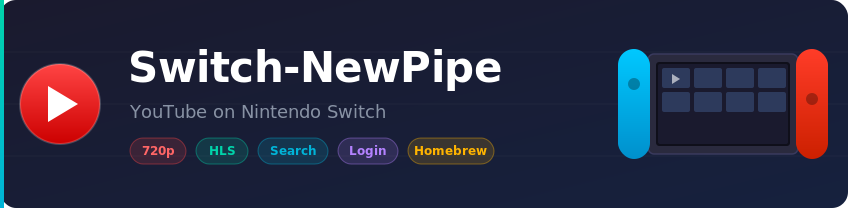

<p align="center">
  
</p>

<p align="center">
  <strong>A free, open-source YouTube client for Nintendo Switch homebrew.</strong><br>
  Inspired by <a href="https://github.com/TeamNewPipe/NewPipe">NewPipe</a> &mdash; no Google account required, no ads, no tracking.
</p>

<p align="center">
  <a href="./README_kr.md">한국어</a>
</p>

---

## Screenshots

| Home Feed | Player (720p) |
|:-:|:-:|
|  |  |

## Install

1. Make sure your Switch has **Atmosphere CFW** with the Homebrew Menu
2. Download `switch_newpipe.nro` from the [latest release](../../releases/latest)
3. Copy it to `sdmc:/switch/switch_newpipe.nro`
4. Launch from the Homebrew Menu

## What You Can Do

- Browse **Home**, **Search**, **Subscriptions**, **Library**, and **Settings**
- Watch YouTube at **720p** (HLS streaming, no throttle)
- Search for any video and play it immediately
- Log in with cookies to see your subscriptions and personalized recommendations
- Save watch history and favorites locally
- English & Korean UI

## Controls

### Main UI

| Button | Action |
|--------|--------|
| `A` | Play video from list |
| `Y` | Open video details |
| `X` | Refresh / Reset defaults |
| `RB` | Manage login session (Subscriptions tab) |

### Player

| Button | Action |
|--------|--------|
| `A` | Pause / Resume |
| `B` | Exit player |
| `Up / Down` | Volume |
| `X / Y` | Toggle OSD overlay |

## Login (Optional)

Switch-NewPipe uses cookie import for YouTube login. No OAuth or Google sign-in required.

**How to set up:**

1. Export your YouTube cookies from a browser (using a cookie export extension)
2. Save the file as `sdmc:/switch/switch_newpipe_auth.txt`
3. Restart the app

Supported formats: raw `Cookie` header, JSON `{"cookie_header":"..."}`, or Netscape `cookies.txt`.

Once logged in, your **Subscriptions** tab and **personalized Home recommendations** will be available.

## Playback Quality

Configure in **Settings** tab:

| Mode | Description |
|------|-------------|
| **Standard 720p** | Best quality. Tries 720p HLS first, falls back gracefully |
| **Compatibility** | Prefers progressive MP4 (video+audio combined) |
| **Data Saver** | Lower quality around 480p to save bandwidth |

## Data Files

All data is stored on your SD card:

| File | Purpose |
|------|---------|
| `sdmc:/switch/switch_newpipe.log` | Debug log |
| `sdmc:/switch/switch_newpipe_settings.json` | Settings |
| `sdmc:/switch/switch_newpipe_library.json` | Watch history & favorites |
| `sdmc:/switch/switch_newpipe_session.json` | Login session |
| `sdmc:/switch/switch_newpipe_auth.txt` | Cookie import (you provide this) |

## Build from Source

Requires Docker and a host C++ compiler.

```bash
# Full build (portlibs + app)
./build.sh

# App only (after first full build)
./build.sh --app-only

# Clean everything
./build.sh --clean
```

Output: `cmake-build-switch/switch_newpipe.nro`

<details>
<summary>Host validation tools (for development)</summary>

```bash
make host
./build/host/switch_newpipe_host
./build/host/switch_newpipe_host --search Zelda
./build/host/switch_newpipe_host --resolve 'https://www.youtube.com/watch?v=dQw4w9WgXcQ'
```

</details>

## Known Limitations

- Seek is not yet supported
- No in-app quality picker during playback
- No in-app Google OAuth (cookie import only)
- Channel pages are not fully browsable yet
- Comments and playlists load first page only

## Tech Stack

- **UI**: [Borealis](https://github.com/natinusala/borealis) (native Switch UI framework)
- **Playback**: mpv + FFmpeg (hardware-accelerated on Switch)
- **Networking**: libcurl + custom YouTube innertube API client
- **Build**: CMake, Docker, devkitPro toolchain

## License

This project is for educational purposes. It is not affiliated with YouTube, Google, or NewPipe.
