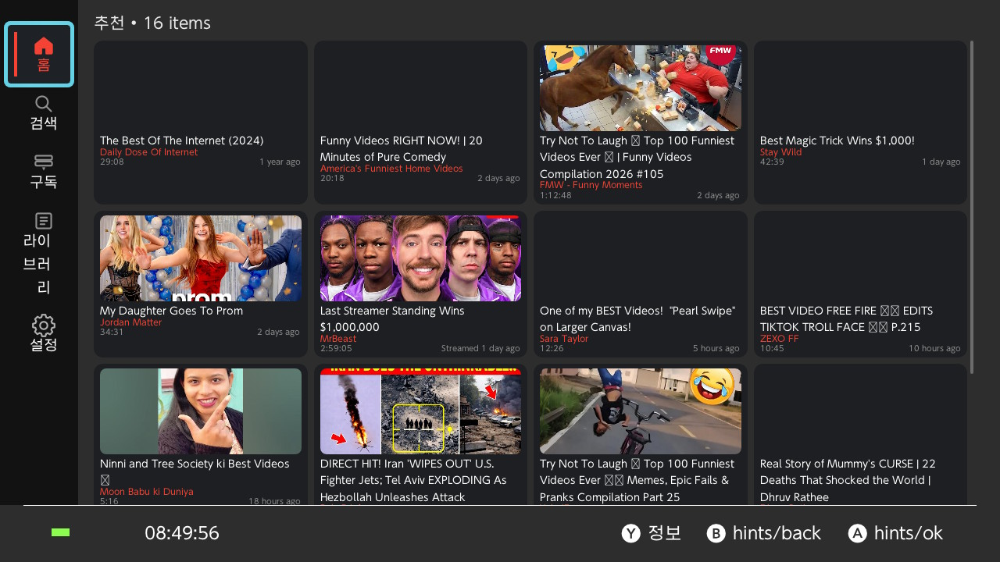
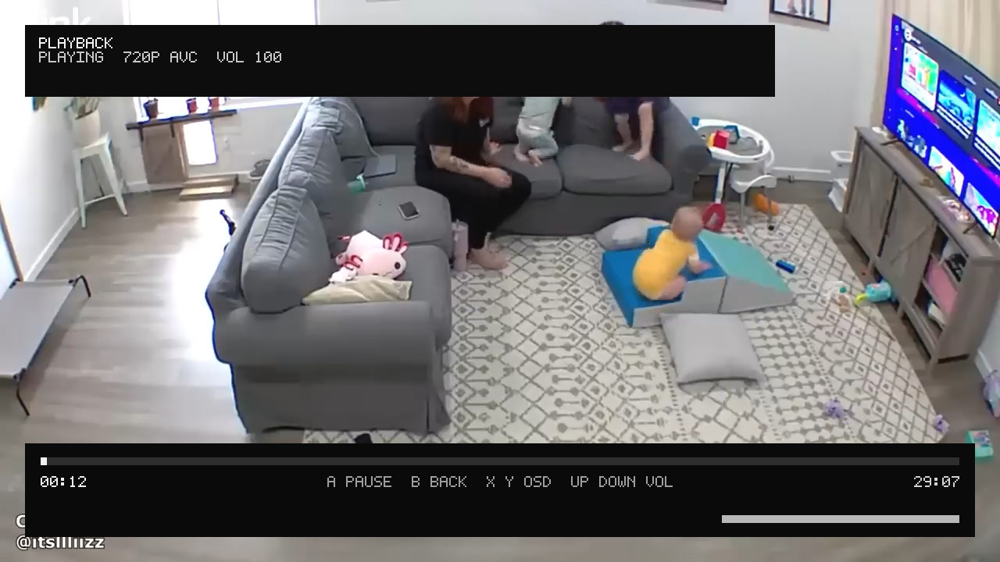

# Switch-NewPipe




Switch-NewPipe is a Nintendo Switch CFW homebrew YouTube app inspired by NewPipe.  
The project targets a practical Switch-native MVP first, not a direct Android NewPipe port.

[한국어 문서 보기](./README_kr.md)

## Current Status

Switch-NewPipe is already beyond a UI scaffold. It currently includes a Borealis-based Switch UI, real YouTube data fetching, on-device playback, logging, settings persistence, and a cookie-import login flow for subscriptions and personalized home recommendations.

Implemented today:

- Borealis native UI with tabs for `Home`, `Search`, `Subscriptions`, `Library`, and `Settings`
- Real YouTube home and search feeds through `YouTubeCatalogService`
- Login-aware home recommendations using `FEwhat_to_watch` when a valid session exists
- Cookie-based session import and persisted auth state
- Subscription feed through authenticated `FEsubscriptions` browse requests
- Stream detail screen with description, channel access, related videos, playlists, and comments
- Related videos via a `watch-next` parser
- Playlist parsing via `youtubei/v1/browse`
- First-page comments parsing via watch-page continuations and `youtubei/v1/next`
- Library persistence for watch history and favorites
- Persisted settings for startup tab, default home category, playback policy, short-video filtering, and language
- Async thumbnail loading
- Switch playback loop using SDL2, OpenGL ES, and mpv
- Loading spinner and playback status text
- In-player OSD with title, status, quality, progress, and volume
- File logging at `sdmc:/switch/switch_newpipe.log`
- Host-side validation tools through `make host`
- English/Korean i18n with Switch app language selection

Still missing or incomplete:

- Download support
- Seek
- Manual in-player quality picker UI
- In-app Google OAuth / WebView login
- Browse-style channel home/tab structure
- Full pagination for comments and playlists

## Features

### Home and Search

- Real YouTube content instead of placeholder fixtures
- Home categories for `Recommended`, `Live`, `Music`, and `Gaming`
- Search backed by live YouTube responses
- `A` plays immediately from list views
- `Y` opens the detail screen

### Login and Subscriptions

Switch-NewPipe does not use in-app OAuth yet. Authentication currently works by importing YouTube/Google cookies from outside the app.

- Default auth import file:
  - `sdmc:/switch/switch_newpipe_auth.txt`
- Accepted formats:
  - raw `Cookie` header
  - JSON `{"cookie_header":"..."}`
  - Netscape `cookies.txt`
- Saved normalized session:
  - `sdmc:/switch/switch_newpipe_session.json`
- `RB` opens session management in the `Subscriptions` tab
- `X` refreshes the subscriptions feed
- If login is available, the `Recommended` home section tries a personalized feed first

### Library

- Storage file:
  - `sdmc:/switch/switch_newpipe_library.json`
- Current support:
  - watch history
  - favorites
  - section switching in the library tab
  - clearing the current section

### Settings

- Storage file:
  - `sdmc:/switch/switch_newpipe_settings.json`
- Current support:
  - startup tab
  - default home category
  - playback quality policy
  - hide short videos
  - app language
- Supported languages:
  - system default
  - Korean
  - English
- `X` restores defaults from the settings tab

### Playback

Player input:

- `A`: pause / resume
- `B`: exit player
- `Up / Down`: volume
- `X / Y`: toggle pinned OSD

Playback policies:

- `Standard 720p`
  - prefers 720p paths first
  - falls back when necessary
- `Compatibility First`
  - prefers progressive MP4 paths
- `Data Saver`
  - prefers lower progressive formats around 480p

Current limitation:

- seek is still disabled

## Logging and Data Files

- Log file:
  - `sdmc:/switch/switch_newpipe.log`
- Settings:
  - `sdmc:/switch/switch_newpipe_settings.json`
- Library:
  - `sdmc:/switch/switch_newpipe_library.json`
- Auth import file:
  - `sdmc:/switch/switch_newpipe_auth.txt`
- Saved login session:
  - `sdmc:/switch/switch_newpipe_session.json`

## References

- `reference/NewPipe`
  - upstream Android NewPipe reference
- `reference/switchzzk`
  - Switch Borealis + mpv + ffmpeg playback reference
- `reference/wiliwili`
  - Switch / cross-platform UI and playback reference

## Build

Switch build:

```bash
./build.sh
```

Host validation:

```bash
make host
./build/host/switch_newpipe_host
./build/host/switch_newpipe_host --search Zelda
./build/host/switch_newpipe_host --subscriptions --auth-file ./switch_newpipe_auth.txt
./build/host/switch_newpipe_host --related 'https://www.youtube.com/watch?v=dQw4w9WgXcQ'
./build/host/switch_newpipe_host --channel 'https://www.youtube.com/watch?v=dQw4w9WgXcQ'
./build/host/switch_newpipe_host --playlist 'https://www.youtube.com/watch?v=ZZcuSBouhVA&list=PL8F6B0753B2CCA128'
./build/host/switch_newpipe_host --comments 'https://www.youtube.com/watch?v=dQw4w9WgXcQ'
./build/host/switch_newpipe_host --resolve 'https://www.youtube.com/watch?v=dQw4w9WgXcQ'
```

## Project Docs

- Architecture:
  - `docs/architecture.md`
- Playback notes:
  - `docs/playback.md`
- Toolchain and build:
  - `docs/toolchain.md`
- Current handoff:
  - `docs/handoff.md`
- Device testing checklist:
  - `docs/testing.md`
- Roadmap:
  - `docs/roadmap.md`
